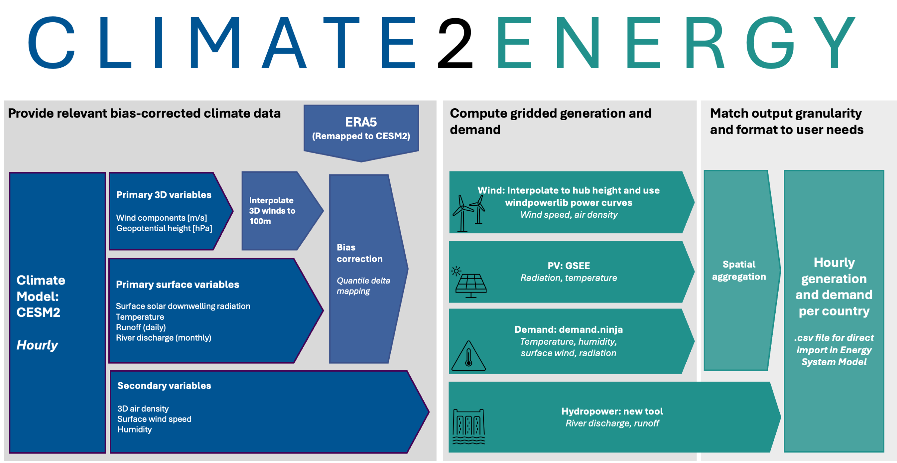

# Climate2Energy (C2E)

This repository contains the code to translate tailored climate model output to country-level hourly energy-system model inputs. A description of the methods used is given in the following journal publication

> J. Wohland, L. Bloin-Wibe, E. Fischer, L. Goeke, R. Knutti, F. De Marco, U. Beyerle, J. Savelsberg, Climate2Energy: a framework to consistently
include climate change into energy system modeling, 2025

C2E covers solar PV, wind energy (3 different turbines, both onshore and offshore), demand for heating and cooling, run-of-river generation, and weekly reservoir inflow. The methodology includes bias correction, accounts for internal climate variability by using multiple climate model realization and draws from existing peer-reviewed tools on the technology level, such as the [Global Solar Energy Estimator](https://github.com/renewables-ninja/gsee), turbine power curves from the [windpowerlib](https://github.com/wind-python/windpowerlib), and [demand.ninja](https://github.com/renewables-ninja/demand-ninja).



*Fig. 1: The Climate2Energy (C2E) framework to convert tailored climate model output to energy system model input. Key steps are separated by color: provision of relevant bias-corrected climate data (blue), computation of gridded generation and demand estimates (green), and postprocessing to match the desired data granularity (green). Where possible, we use established tools, for example, to compute PV and wind capacity factors, and heating/cooling demand. We develop a new sub-module to compute hydropower generation and test it relative to existing databases. Ultimately, C2E provides csv files on country granularity that can be immediately used in energy system optimization models. Figure is taken from Wohland et al. (2025), where more detail is provided.*


# If you want to use the outputs of C2E

Easy: We provide C2E country-level output files for all realizations and gridded capacity factor fields for three realizations on [zenodo](https://doi.org/10.5281/zenodo.15269455).

# If you want to re-run C2E with the CESM2 model data used in Wohland et. al (2025)

You run C2E by navigating to the `code` folder and executing this command:

```
bash - l run_all.sh
```

This command, however, will only finish successfully if you (A) install all environments, (B) download the relevant input data, and (C) get the hourly CESM2 input (approx. 20TB) from us. Detailed instructions follow. It may sound complicated, but we know you can do it :muscle:.

## A) Create environments

There are three seperate environment needed to run different parts of the tool. They can not be easily unified because they have incompatible version requirements of some other packages.

### Main environment

`mamba env create --file environment.yml  --name CESM2energy`

To run the jupyter notebooks, you might have to add `ipykernel` by (a) creating the environment above, (b) activating it (`conda activate CESMenergy`), 
and (c) running `conda install ipykernel`.

### Demand environment

`mamba env create --file environment_demandninja.yml  --name demand_ninja`

This environment is exclusively needed to run `code/conversion_to_demand.py`

### Hydropower environment 

`mamba env create --file environment_hydro.yml  --name hydro`

This environment is exclusively needed to run `code/conversion_to_demand.py`

## B) Download input files

### Shapefiles of Exclusive Economic Zones for offshore wind computations

The offshore assessment relies on the shapes of EEZ, in particular the World EEZ v11 (2019-11-18) shapefile provided by the Flanders Marine Institute and available at https://www.marineregions.org/download_file.php?name=World_EEZ_v11_20191118.zip

Download and extract the data to `inputs/EEZ/`.

### Population data from NASA/Columbia Uni

After registration, data can be retrieved from the link below. We choose the highest resolution (2.5 minutes). Data must be unzipped and the file `gpw_v4_population_density_adjusted_rev11_2pt5_min.nc` must be moved into the `inputs` folder. 

https://sedac.ciesin.columbia.edu/data/set/gpw-v4-population-density-adjusted-to-2015-unwpp-country-totals-rev11/data-download

### Worldbank total population data
Lists of total populations in different countries need to be provided

  https://data.worldbank.org/indicator/SP.POP.TOTL

Download the file as csv, and save it in `inputs` as World_bank_population.csv

### JRC-IDEES-2015_v1 data

We provide electrified heating demand using the currently electrified share (using demand-ninja and CESM2 climate information) as well as a scaled version. The scaled version assumes that all heating is fully electrified and can be used to create scenarios (e.g., division by 5 corresponds to a scenario where 20% of heating is met by electricity). The scaling needs input data from the Joint Research Center (JRC) Integrated Database of the European Energy System (IDEES) which must be downloaded by running 

`bash download_JRC.sh`

from the `code` folder, which downloads and unzipped the required inputs.

https://github.com/energy-modelling-toolkit/hydro-power-database/

### Download JRC Hydropower Database
Download the file "jrc-hydro-power-plant-database.csv" from the [Energy Modeling toolkit GitHub repository](https://github.com/energy-modelling-toolkit/hydro-power-database/) and save it in the `inputs` folder.
This file contains the location and the installed capacity (nominal power of the turbine) of hydropower plants (run-of-river, reservoir, pumped-hydro) in Europe.

### Download run-of-river generation from ENTSO-e Transparency platform
On ENTSO-e Transparency platform (https://transparency.entsoe.eu/), download run-of-river generation per each year per each country:
- Go to Generation>Actual generation per production type
- Select "Country" and in "Area" select the desired country.
- In "Production Type" select only "Hydro Run-of-river and poundage".
- Download the full year at Export Data>Actual Generation per Production Type (Year,CSV).
The file name should have this format: "Actual Generation per Production Type_201501010000-201601010000.csv".

### Download reservoir filling level and reservoir generation from ENTSO-e Transparency platform
#### Reservoir filling level
On ENTSO-e Transparency platform (https://transparency.entsoe.eu/), download reservoir filling level per each country:
- Go to Generation>Water Reservoirs and Hydro Storage Plants
- Select "Country" and in "Area" select the desired country.
- Download the csv at Export Data>Water Reservoirs and Hydro Storage Plants (CSV).
This will fetch a unique file that contains all reservoir filling levels from 2014 to the day of download.
The file name should have this format: "Water Reservoirs and Hydro Storage Plants_201412290000-202412300000.csv".
#### Reservoir generation
On ENTSO-e Transparency platform (https://transparency.entsoe.eu/), download reservoir generation per each year per each country:
- Go to Generation>Actual generation per production type
- Select "Country" and in "Area" select the desired country.
- In "Production Type" select only "Hydro Water Reservoir".
- Download the full year at Export Data>Actual Generation per Production Type (Year,CSV).
The file name should have this format: "Actual Generation per Production Type_201501010000-201601010000.csv".

#### Save the downloaded files into the input folder
With Reservoir filling levels and Reservoir generation it will be possible to compute the historical energy inflow in reservoirs.

In the folder `inputs`, create the folder `entsoe_inflow`. In this folder, create one folder per country, named with the country name, e.g. `Austria`. Make sure the names are capitalized.
Save the single reservoir filling level csv file downloaded (one file for all the years) and all the Reservoir generation files (one file per year, so multiple files) from ENTSO-e into the folder of the corresponding country.

In the folder `inputs`, create the folder `entsoe_ror`. In this folder, create one folder per country, named with the country name, e.g. `Austria`. Make sure the names are capitalized.
Save the csv file downloaded from ENTSO-e into the folder of the corresponding country.

### Download ENTSO-e power stats for scaling output to actual annual averages
Download Monthly Domestic Values aggregated by country for 2021, 2022 and 2023 as .csv files, and save into folder `inputs/entsoe_scaling/`

https://www.entsoe.eu/data/power-stats/

### Download ERA5 data

ERA5 is used in the bias correction and needs to retrieved seperately. It is input on the ERA5 native resolution and then coarsened (in space in time) to match the CESM2 granularity. **Luna: we need a description of the other variables used in the bias correction as well** 

#### Discharge
Download consolidated LISFLOOD ERA5 River discharge in the last 24 hours for the years 1995 to 2023. Make sure to select Europe with the following coordinates lat = (30,75), lon = (-15,50)
https://cds.climate.copernicus.eu/cdsapp#!/dataset/cems-glofas-historical?tab=form

The files should be added to the folder `inputs/ERA5/`, and should follow the naming structure "discharge_{year}.nc"

### Gaussian smoothed power curves from the windpowerlib (provided as part of this repository)

The conversion to wind capacity factors is based on power curves from the windpowerlib [1] that have been selected and smoothed following [2]. These curves are provided as part of the repository in `inputs/power_curves` and they do not need to be separately downloaded. 

[1] https://github.com/wind-python/windpowerlib/blob/dev/windpowerlib/oedb/power_curves.csv
[2] Wohland, J., Brayshaw, D. & Pfenninger, S. Mitigating a century of European renewable variability with transmission and informed siting. Environ. Res. Lett. 16, 064026 (2021).

## C) Get CESM2 climate model data that C2E uses

C2E uses tailored hourly climate model output that is not readily available from climate model intercomparisons like CMIP or CORDEX. 
A detailed description is in Wohland et al. (2025, under review), but essentially we ran the climate model CESM2 to provide customized outputs that are optimized for the climate-to-energy conversion:

|Variable name | Abbreviation | 3D/2D | temporal resolution |
| ------------- | ------------- |------------- | ------------- |
|Wind components | $U$, $V$ | 3D | hourly|
|Air density | $\rho$ | 3D | hourly |
|Geopotential height | $Z_g$ | 3D | hourly |
|Surface solar downwelling radiation | RSDS | 2D | hourly|
|Surface temperature | $T$ | 2D | hourly |
|Runoff | $R$ | 2D | hourly|
|River discharge | $Q$ | 2D | monthly  |
|Specific humidity | $q$ | 2D  | hourly |
|Surface wind speeds |$U_{10}$ | 2D | hourly|

Those variables are available globally. 

River discharge is provided on monthly timescales and downscaled to daily (run-of-river) and weekly (reservoir inflows) in the postprocessing because we only learned that we would need it after finishing the CESM2 simulations. In follow up studies, also river discharge should be provided at higher temporal resolution. 

The CESM2 output is about 20TB, which exceeds the limits for data sharing on, for example, zenodo. If you want to use the data, please send an email to jan.wohland@its.uio.no, explaining what kind of research you want to perform. We will then jointly try to find a way to make the data available to you. 

### Overview of climate model realizations

To capture climate variability, we choose a 3-member ensemble from a larger CESM2 ensemble as follows:

| Name  | historical (1995-2015) | SSP370 (2080-2100) | SSP245 (2080-2100) |
| ------------- | ------------- |------------- | ------------- |
| `A`  | **real = 1500**  | **real = 1500** | **real = 1500** | 
| `B`  | **max(NAO): real =1000** |  **max(NAO): real = 0600** |  | 
| `C`  | **min(NAO): real =1200** | **min(NAO): real = 0900** |  | 

More explanation is provided in Wohland et al. (2025).

### Climate model grid
Information of the grid used by the climate model needs to be provided for the bias correction. 
The code reads grid information from `inputs/CESM_atm_grid.txt`.


# Description of Climate2Energy output

### Output units
Climate2Energy provides country-level .csv files of all considered technologies. For Wind and PV, the file is output as hourly capacity factors (between 0 and 1). For demand, the file is output as hourly GWh. For hydro inflow and hydro ror, the output is also GWh, but the timesteps are weekly and daily, respectively, which means that the output is the cumulative GWh in that week or day. To get output as GWh per hour, a simple fix would be to resample the dataset to hourly (ffill() + divide all values by 24*7 or 24, respectively).

### Get just the .csv files in one folder
From `output/bias_correction/`, run `cp --parents */*/*/output_variables/*.csv only_csv/`.

### Get just the .nc files for the main realizations in one folder
Again from `output/bias_correction/`, run `cp --parents A/*/A/output_variables/*.nc only_nc/`, then `cp --parents B/*/B/output_variables/*.nc only_nc/`, and `cp --parents C/*/C/output_variables/*.nc only_nc/`.

# Generalization to other climate models (under development)
To run the conversion tool for another climate model than CESM2, you will need to use the branch generalize_IO. Here you can specifiy your own input files and output location. Note that you will still have to preprocess you files to match the naming conventions used in the conversion tool (see preprocess_cordex.py for an example of this).
However, bias correction is not yet implemented in the generalize_IO branch. If you need to bias correct your data as part of the conversion, you will need to fork the repo and change the file paths according to the data you have available.

# Contributions
You are very welcome to contribute to development of this tool. Reach out to us via issues or mail to suggest improvements and/or changes.

C2E is mainly developed by Jan Wohland (University of Oslo, jan.wohland@its.uio.no) and Luna Bloin-Wibe (ETH Zurich, luna.bloinwibe@env.ethz.ch) with additional contributions from Francesco De Marco (ETH Zurich). 

# Versions
The scientific publication Wohland et al. (2025) is based on C2E v1 (published as release on 22nd of April 2025). 

# License and credit
C2E has an open licence, encouraging everyone to contribute, improve and/or use the tool. When doing so, please reference the corresponding journal article Wohland et al. (2025). 

Happy coding!
